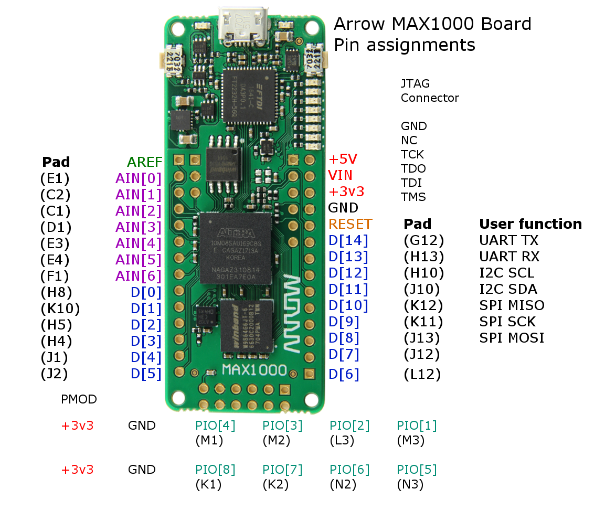

# Overview 
This Repo collects the code for several Variations of a TDC implemented on both a small Max10 and a Max10 Development Kit.
Details on the general idea and implementation can be found in my Bachelor thesis (Jan Höfer, Heidelberg University, Group mu3e)

## Max10

### General
The Max 10 is a small, low-price FPGA. Regradless of its size and slow clock of only 12 MHz, the TDC could achieve bin sizes of roughly 300 ps. Readout works via UART communication

To feed input signals in the Max10, a Waveform Generator was used. Connect the ground to the GND and the input to PIN_L12. Input are rectangular signals with 3.3 V. 

The FPGA is programmed via JTAG. The following driver is needed: 

https://shop.trenz-electronic.de/en/Download/?path=Trenz_Electronic/Software/Drivers/Arrow_USB_Programmer

### One channel, Fine & Coarse
In the folder OneChannel_FineAndCoarse you find a project which implements a single delay line plus a coarse counter. The
delay line is forced to be placed in a single line to achieve optimal timing. The commands are generated by loc_assign.py. 

The Python script read_with_coarse.py in Max10/Analysis read the data sent via UART. It creates a new folder for each measurement
and writes the fine and coarse timestamps in seperate .txt files. The name of the serial port might have to be changed.

__Important__: First start running the script, then programm the FPGA and start the measurement. Otherwise the bits are mixed up in the readout.

To analyze the fine bin distribution of the delay line, run one_channel_plot_fine. Provide it with the name of the folder you want to analyze. It plots a live histogram during one measurement and also saves the full histogram once closed.

### Four channels, Only Fine
In the folder FourChannels_OnlyFine, there is a project that implements four parallel delay lines. Again, the delay lines are forced to be placed in a single line for optimal timing. The commands are generated by loc_assign.py. Change the x values in the script to shift the lines. If you only want to use a subset of the delay lines, just feed them a dummy signal and the compiler will not place them on the chip.

In this current version, one input is fed to all delay lines, but this can be changed to separate inputs for each line to make coincidence measurements. For example, if one wants to measure the offset between two signals, each of those signals can be fed into two delay lines. Then, one could take the mean of the measurements of each pair of delay lines and calculate the offset from this mean. 

The script read_serial reads to output of the FPGA via UART. At the moment, each input signal generates a 16 Bit output for each channel. The necessary 9 bit fine timestamp is concatenated with a 2 bit ID ('00', '01', '10', '11') and the remaining 5 bits are wasted. This of course can be improved by using a header or a predefined order for the output order of the channels. Also coarse timing information could be added. 

For some reason, it can happen that the order of the output is shifted. Then the bits read by the script do not make sense as the channel ID is taken as timing information in this case. It only happens rarely and could be detected within the script to automatically correct.

Quickly plot the bin histograms with plot_hist.py. In the current configuration, the first two lines are longer and thus better than lines 3 & 4. This can be optimized by altering the position of the lines on the FPGA using the loc_assign script. The entries at the maximum bin 4 * 72 = 288 are a result of overflow. This happens when a signal arrives during the reset stage leading to the maximum value being recorded.

